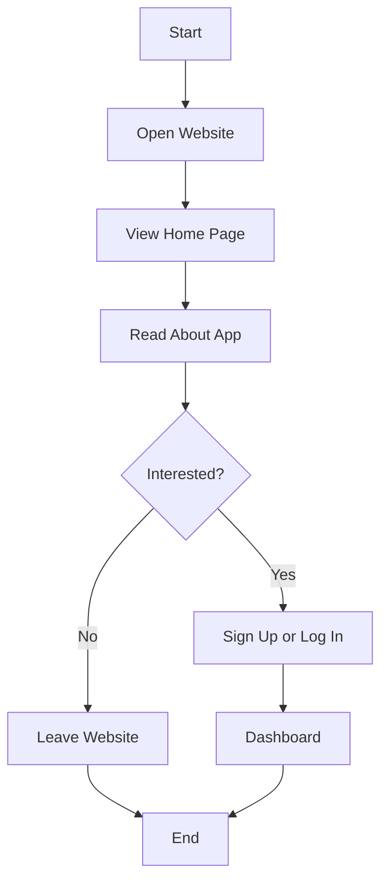
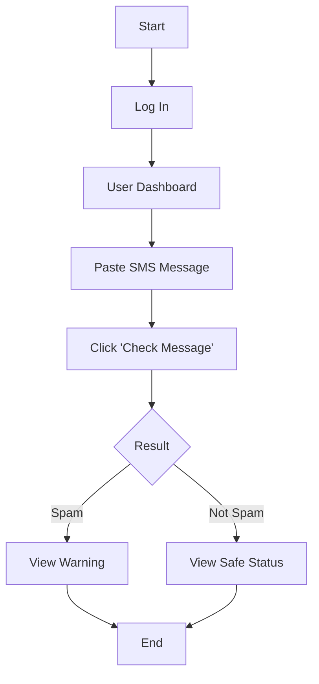
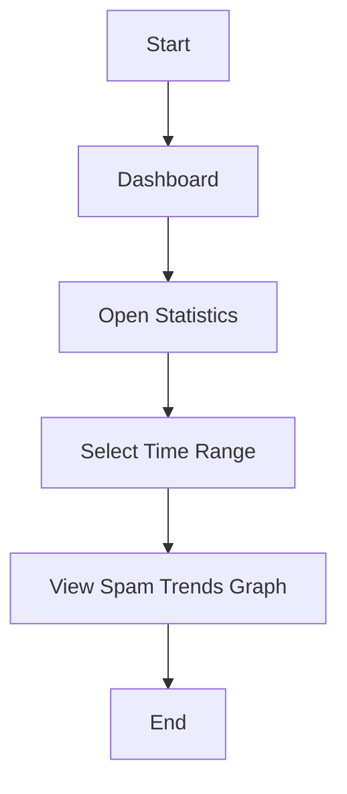
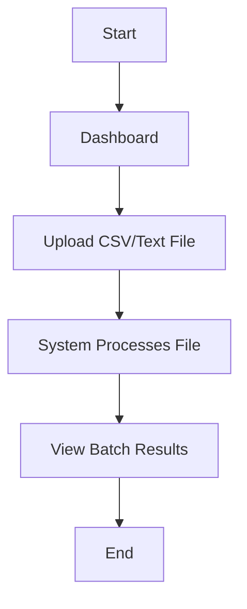
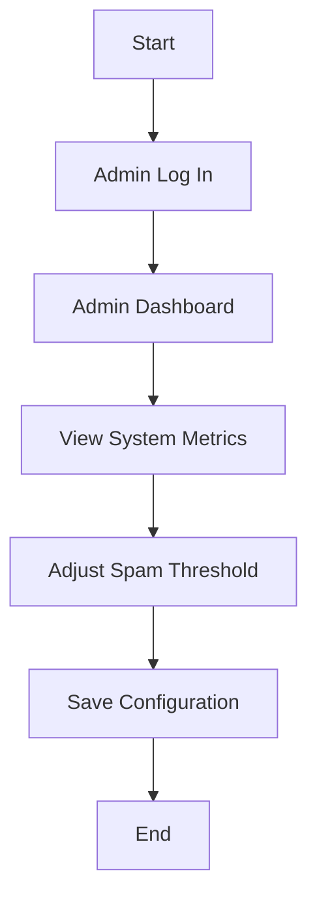
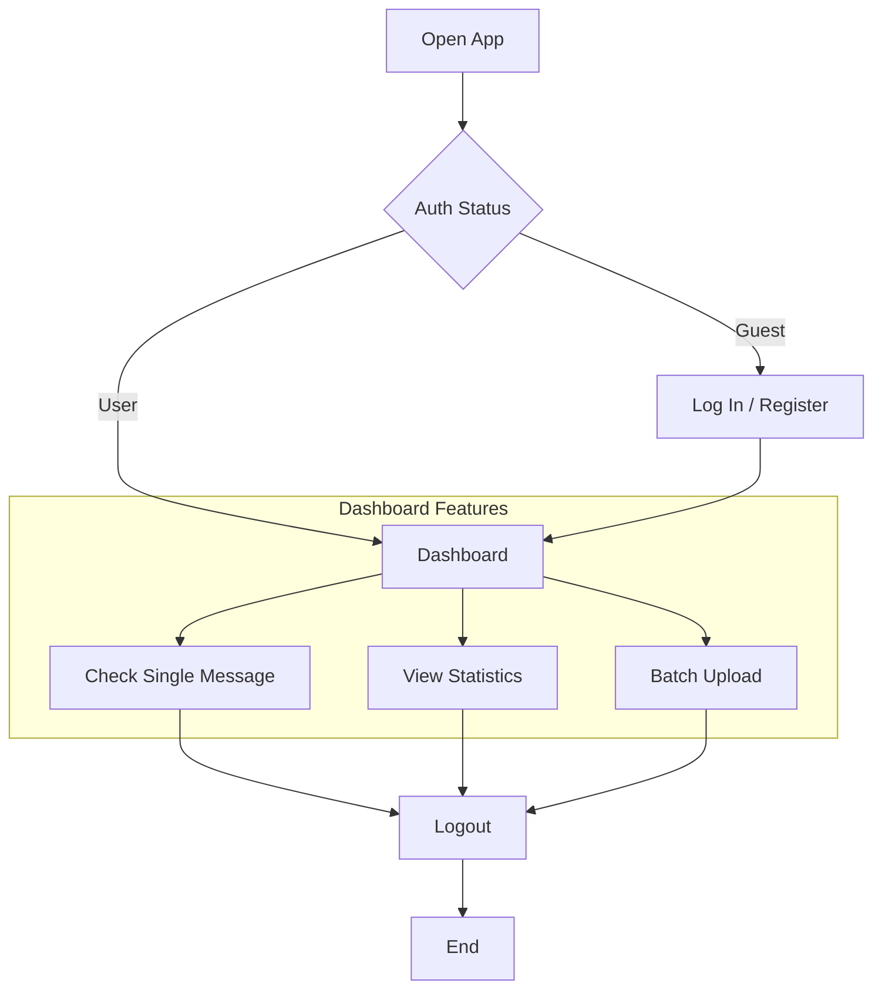
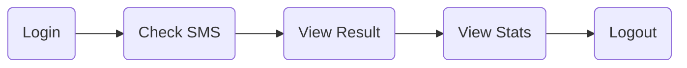

# 📱 SMS Spam Detection App


A modern, user-friendly web application designed to help users identify **Spam** vs. **Not Spam** SMS messages instantly. The platform also provides insightful analytics on spam trends over time, catering to both casual users and administrators.

---

## 📋 Table of Contents
- [About the Project](#-about-the-project)
- [Key Features](#-key-features)
- [User Roles](#-user-roles)
- [Workflows & Architecture](#-workflows--architecture)
  - [Visitor Journey](#visitor-journey)
  - [Regular User Journey](#regular-user-journey)
  - [Admin Journey](#admin-journey)
  - [Overall System Flow](#overall-system-flow)
- [Getting Started](#-getting-started)
- [Contributing](#-contributing)
- [License](#-license)

---

## 📖 About the Project

In an era of increasing digital communication, spam messages are more than just a nuisance—they are a security risk. This application provides a simple interface for anyone to verify the legitimacy of an SMS message. 

**Core Functionality:**
- **Instant Analysis**: Paste a message and get an immediate "Spam" or "Not Spam" verdict.
- **Trend Analysis**: Visualizes data to show spam volume trends over weeks and months.
- **Bulk Processing**: Upload files to check multiple messages at once.

---
## ✨ Figma

https://www.figma.com/design/WrSNfMpBFqShAP8NEFwE5g/SMART-INBOX?node-id=0-1&t=oKSXOne41sRMjGmM-1

## ✨ Key Features

### 🔍 For Everyone
- Clean, intuitive Dashboard.
- Real-time spam detection.
- Historical data visualization.

### 🛡️ For Admins
- System status monitoring.
- Adjustable spam detection sensitivity.
- User management and analytics.

---

## 👥 User Roles

| Role | Description |
| :--- | :--- |
| **Visitor** | Can browse the landing page, read about the app, and sign up/login. |
| **Regular User** | Can check messages, upload batch files, and view personal/global statistics. |
| **Admin** | Has full access to system configuration, user logs, and model tuning parameters. |

---

## 🔄 Workflows & Architecture

The application is designed with clear, simplified workflows for each user type.


### Visitor Journey
*From landing page to dashboard.*



### Regular User Journey

#### 1. Check SMS
*The core functionality for verifying messages.*



#### 2. View Statistics
*Understanding spam trends.*



#### 3. Upload Multiple Messages
*Batch processing for high-volume checks.*



### Admin Journey
*System management and configuration.*



### Overall System Flow
*High-level view of the entire application structure.*



## 🚀 Summary

A quick overview of the primary user loop:



---

## 💻 Getting Started

*(Instructions to be added once codebase is initialized)*

1.  Clone the repository:
    ```bash
    git clone https://github.com/yourusername/sms-spam-detection.git
    ```
2.  Install dependencies:
    ```bash
    npm install
    # or
    pip install -r requirements.txt
    ```
3.  Run the application:
    ```bash
    npm start
    # or
    python app.py
    ```

---

## 🤝 Contributing

Contributions are what make the open-source community such an amazing place to learn, inspire, and create. Any contributions you make are **greatly appreciated**.

1.  Fork the Project
2.  Create your Feature Branch (`git checkout -b feature/AmazingFeature`)
3.  Commit your Changes (`git commit -m 'Add some AmazingFeature'`)
4.  Push to the Branch (`git push origin feature/AmazingFeature`)
5.  Open a Pull Request

---

## 📝 License

Distributed under the MIT License. See `LICENSE` for more information.
