# �️ SmartInbox | SMS Spam Detection System

> **Advanced AI-powered protection against unsolicited messaging and digital threats.**

---

### � Navigation
**[ 📘 Project Overview ](#-project-overview) • [ 👥 Consumer Workflow ](#-consumer-workflow) • [ 🏗 System Architecture ](#-system-architecture) • [ 🧩 Tech Stack ](#-tech-stack) • [ 🤝 Contributing ](#-contributing)**

---

## � Project Overview

### 🚩 The Problem
In an era of unchecked digital communication, **SMS spam** has evolved from a nuisance into a significant security vector. Phishing attempts, fraudulent schemes, and unsolicited marketing flood user inboxes, compromising privacy and digital well-being.

### 🎯 The Solution
**SmartInbox** is an enterprise-grade, machine-learning-powered application designed to detect, classify, and filter SMS spam in real-time. By leveraging natural language processing (NLP), it provides an instant verdict on message legitimacy.

### 🚀 Capabilities
- **Real-time Inference**: Sub-millisecond classification of SMS content.
- **Adaptive Learning**: System evolves with new spam patterns.
- **Granular Analytics**: Detailed dashboards for usage and threat statistics.
- **Multi-Role Access**: Tailored experiences for Visitors, Users, and Administrators.

---

## 👥 Consumer Workflow

The platform serves three distinct user personas, each with a specialized journey.

| User Type | Access Level | Primary Goal |
| :--- | :--- | :--- |
| **👤 Visitor** | Public | Explore features, understand the tech, and register. |
| **🔐 User** | Authenticated | Scan messages, view history, and analyze personal stats. |
| **🛡️ Admin** | Elevated | Monitor system health, retrain models, and manage users. |

### � User Journey Map

```mermaid
graph TD
    %% Nodes
    Visitor((👤 Visitor))
    User((🔐 Registered User))
    Admin((🛡️ Admin))
    
    Land[Landing Page]
    Auth[Auth Gateway]
    Dash_U[User Dashboard]
    Dash_A[Admin Dashboard]
    
    Scan[🔍 Scan SMS]
    Hist[📜 View History]
    Stat[📊 Analytics]
    
    Sys[⚙️ System Config]
    Train[🧠 Retrain Model]
    Logs[📝 User Logs]

    %% Edges
    Visitor --> Land
    Land -->|Sign Up / Login| Auth
    
    Auth -->|User Creds| Dash_U
    Auth -->|Admin Creds| Dash_A
    
    Dash_U --> Scan
    Dash_U --> Hist
    Dash_U --> Stat
    
    Dash_A --> Sys
    Dash_A --> Train
    Dash_A --> Logs
    
    Scan -->|Result| Stat
```



---

## 🏗 System Architecture

SmartInbox is built on a decoupled, microservices-inspired architecture ensuring scalability and separation of concerns.

### 🏛️ High-Level Design


### 🔐 Security & Scalability
- **JWT Authentication**: Stateless, secure session management.
- **RESTful API**: Standardized communication between frontend and backend.
- **Model Serialization**: Optimized pickle/joblib model serving for low latency.

---

## 🧩 Tech Stack

### 🎨 Frontend
- **Framework**: React.js / Next.js
- **Styling**: Tailwind CSS (Dark Mode optimization)
- **Visualization**: Recharts / Chart.js
- **State Management**: Redux Toolkit / Context API

### 🔌 Backend
- **Server**: Python (FastAPI / Flask)
- **Validation**: Pydantic
- **Auth**: PyJWT + BCrypt

### 🤖 Machine Learning
- **Libraries**: Scikit-learn, NLTK, Pandas
- **Algorithms**: Naive Bayes / Support Vector Machines (SVM)
- **Vectorization**: TF-IDF / CountVectorizer

### 💾 Database & DevOps
- **Database**: PostgreSQL / SQLite (Dev)
- **Containerization**: Docker
- **CI/CD**: GitHub Actions

---

## ✨ Core Features

### � User Features
- **Instant Spam Check**: Copy-paste interface for immediate results.
- **Bulk Upload**: Support for CSV/TXT file processing.
- **History Log**: Searchable archive of all checked messages.
- **Visual Reports**: Pie charts and trend lines for personal spam stats.

### �️ Admin Features
- **Global Overview**: Real-time monitor of total system requests.
- **Model Performance**: View precision, recall, and F1-scores.
- **User Management**: Ban/Unban capabilities for abuse prevention.
- **System Health**: CPU/Memory usage monitoring (optional integration).

---

## ⚙️ Non-Functional Requirements

- **🚀 Performance**: 95th percentile latency < 200ms for inference.
- **📈 Scalability**: Horizontally scalable API layer to handle traffic spikes.
- **🔒 Security**: Data encryption at rest and in transit (TLS 1.3).
- **🛡️ Reliability**: 99.9% uptime target with automated failover.
- **🧹 Maintainability**: Modular codebase with Type hints and comprehensive docstrings.

---

## 🤝 Contributing

We welcome contributions from the community! Follow these steps to contribute:

1.  **Fork the Repository**
2.  **Clone Locally**
    ```bash
    git clone https://github.com/SOHAMPAL23/SmartInbox.git
    ```
3.  **Create a Branch**
    ```bash
    git checkout -b feature/AmazingFeature
    ```
4.  **Commit Changes**
    ```bash
    git commit -m "feat: Add AmazingFeature"
    ```
5.  **Push to Branch**
    ```bash
    git push origin feature/AmazingFeature
    ```
6.  **Open a Pull Request**
