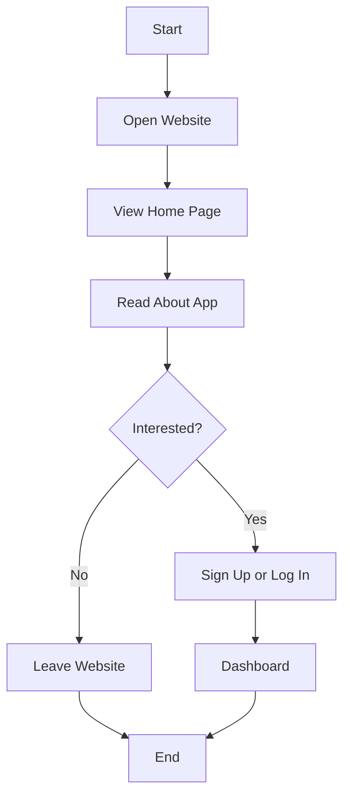
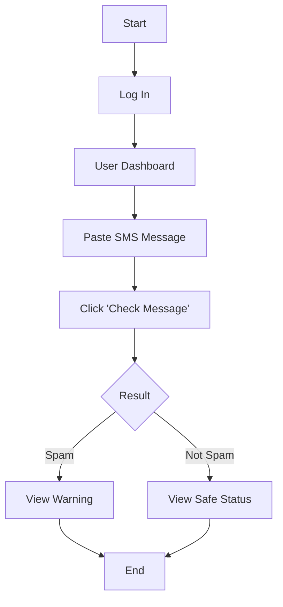
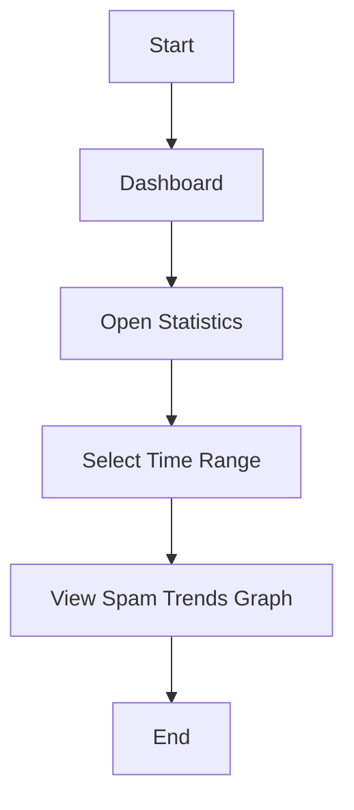
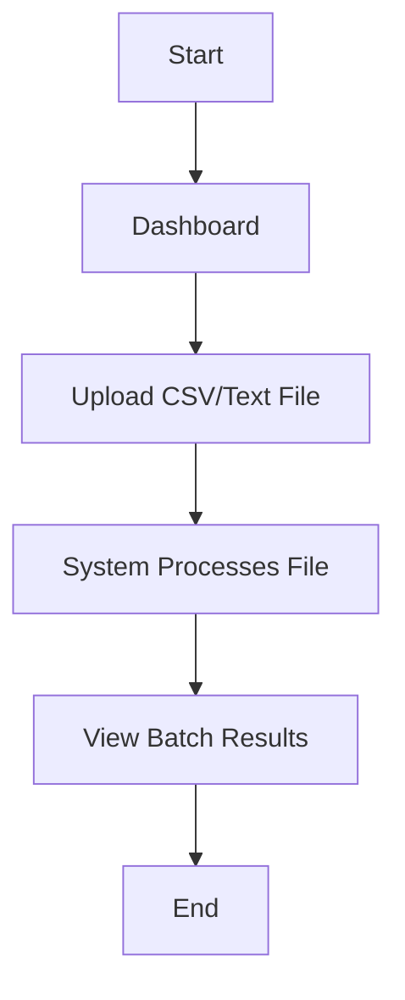
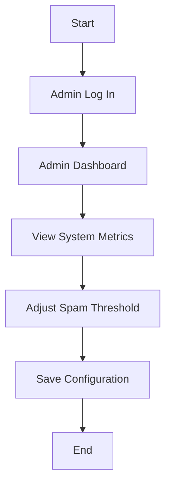
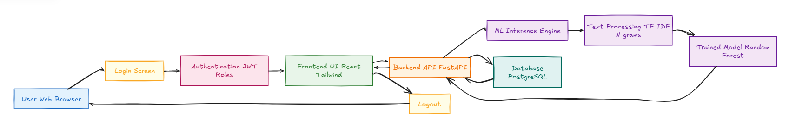
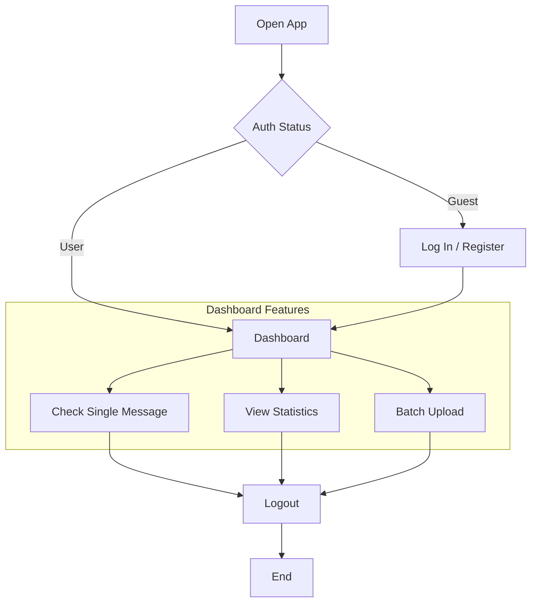
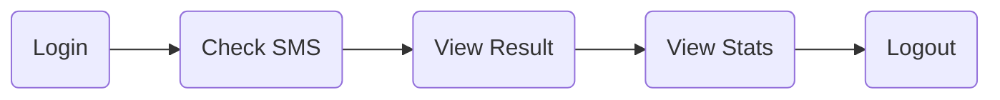

# 🔄 Workflows & Architecture

### [🏠 Home](README.md) &nbsp;|&nbsp; [🎨 Figma Design](FIGMA.md) &nbsp;|&nbsp; [🔄 Workflows](WORKFLOWS.md)

---

The application is designed with clear, simplified workflows for each user type.

## Visitor Journey
*From landing page to dashboard.*

## Regular User Journey

### 1. Check SMS
*The core functionality for verifying messages.*

### 2. View Statistics
*Understanding spam trends.*

### 3. Upload Multiple Messages
*Batch processing for high-volume checks.*

## Admin Journey
*System management and configuration.*

## Overall System Flow
*High-level view of the entire application structure.*

## 🚀 Summary

A quick overview of the primary user loop:

